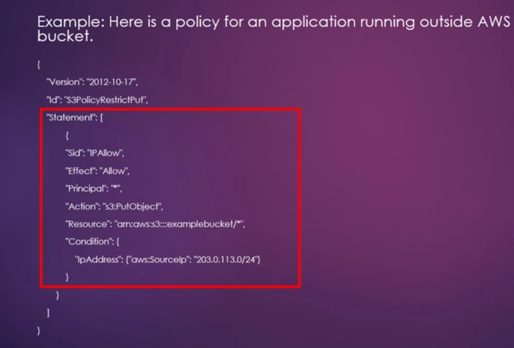
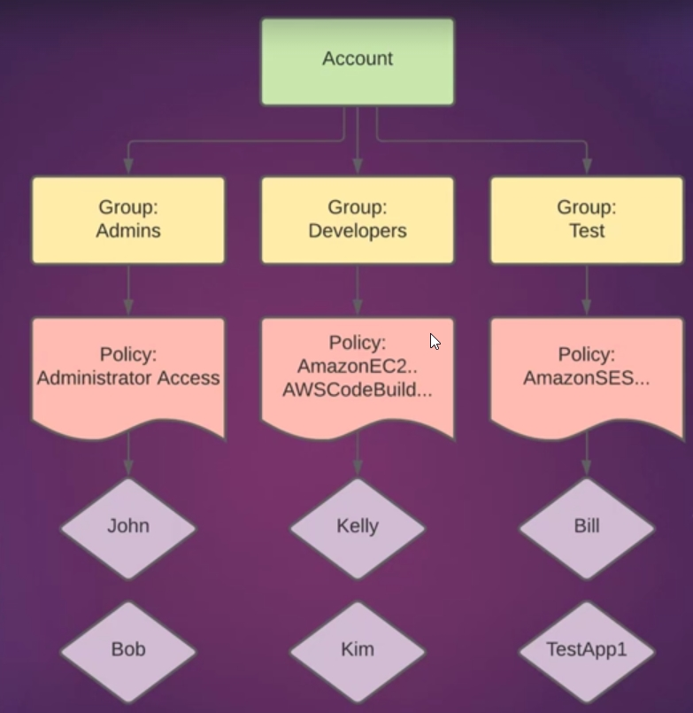
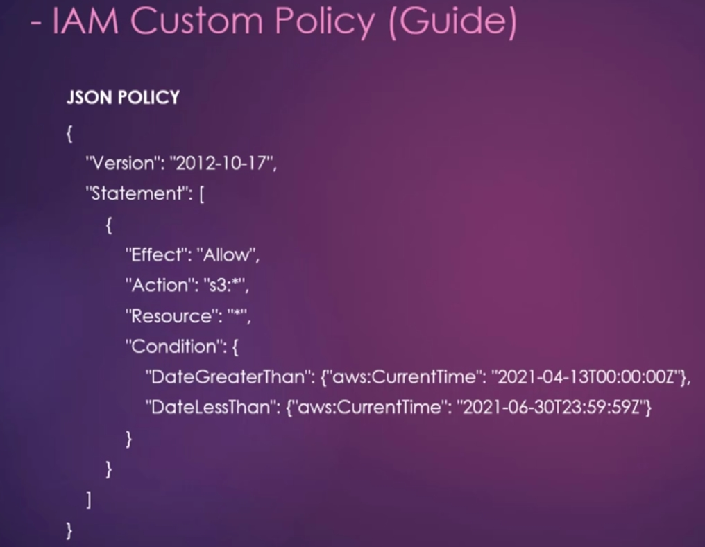
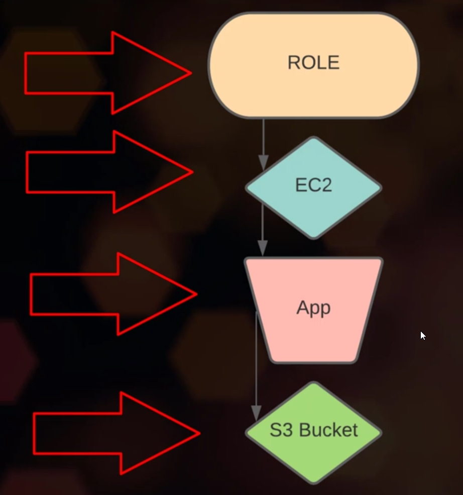

# IAM
## Useful Links
- [Link for a complete list of Actions, Resources, and Condition Keys for Aws](https://docs.aws.amazon.com/service-authorization/latest/reference/reference_policies_actions-resources-contextkeys.html)
- (Exaustive list of AWS services)[https://docs.aws.amazon.com/IAM/latest/UserGuide/reference_aws-services-that-work-with-iam.html]
## What is IAM
- AWS Identity and Access Management (IAM) is a web service that helps you securely control access to AWS resources. You use IAM to control who is `Authenticated and Authorized to use resources`.
- All AWS accounts start with `single sign-in identity` known as the `Root account`.
- This `Root user account` has complete access to all AWS services within the account.
- Root access should only be used for certain account management tasks.
### Characteristics of IAM
- IAM user accounts allow others to administer the resources in AWS account `without having to share passwords`.
- IAM accounts allow `granular permissions`. Each IAM user can be Granted a diffirent level of privileges for diffirent resources in the AWS account.
- IAM credentials can also be used by applications that run on EC2/Lambda/etc instances.
- IAM supports MFA for an added layer of security.
- IAM provides the ability to logs access recordes or users that have made requests under the AWS account (tracking period 400DaysAgo-Now). Known as `Identity Information for Assurance`.
- Logging can be enabled using `AWS CloudTrail`.
  - **AWS CLoudTrail** is a service that enables governance, compliance, operational auditing, and risk auditing of your AWS account.
- IAM is `integrated with many AWS-Services`, including:
  - Compute, Container, Storage, DB, Developer Tools, Security, Identity and Many more.
  - Complete List (here)[https://docs.aws.amazon.com/IAM/latest/UserGuide/reference_aws-services-that-work-with-iam.html]
- `IAM Data` is `Eventually Consistant`, changes made to updataing IAM-Identities or policies are stored and replicated across multiple servers withis AWS's data Centers around the world.
### How IAM Can Be Accessed
- (Web Browser) AWS Management Console
- (Programatically) AWS Command Line Tools:
   - (AWS CLI) AWS Command Line Interface
   - (AWS Tools PowerShell) AWS Tools for Windows PowerShell
- (SDKs - Programatically) AWS Software Development Kits, for diffirent languages.
- IAM HTTPS API

### IAM Mechanics (Theory)
- **IAM Workflow**:
  1. Principals
  2. Authentication
  3. Request
  4. Authorization
  5. Action/Operation
  6. Resources
#### Principals
`a person or application that uses AWS account (root user, IAM-User, IAM-Rolee)` to sign-in and make request to AWS. `Pre-defined security and permission policies` will govern the permissions associated with the principal.
#### Authentication
A Principal will need to Authenticate in order to sign-in and use AWS services. 
`Exceptions include`: **AWS S3** and **AWS STS** since they re both special usecases in term of use cases. 
Authentication is either through `login credentials(Username/PW/MFA)` or `Secret Access Keys`.
#### Request
Once Authenticated the principal can make a request using either the `AWS Management Console, AWS APi, or AWS CLI`.
- **Request Includes**:
  - `Action Or operations`. Ex: Deploy an EC2 instance through the AWS M-Console.
  - `Resources`. Refers to the AWS resource objects that will be included as part of the action or operation. Ex:EC2, AWS S3, etc.
#### Authorization
- Before a request to perform an action or operation is granted, it must be authorized to do it.
- Authorization is performed by evaluating data from the request against predefined policies that may be associated with the request.
- AWS stores policies as JSON documents that specify permissions for principal entities.
- **Note** Only the Root Level user is granted access to all resources and services by default on AWS account.
- All other IAM-users, IAM-Roles must have policies in place, which specify their access rights.
- If no Policies exist for an IAM identity, the user will not have access to any services until a policy is created.
#### Action/Operation
- If a `request is authorized`, the action or operation `is executed`.
- Operations are defined by a service, and include things that you can do to a resource, such (CRUD) that resource.
- [Link for a complete list of Actions, Resources, and Condition Keys for Aws](https://docs.aws.amazon.com/service-authorization/latest/reference/reference_policies_actions-resources-contextkeys.html)
- **Examples**:
  - **IAM support** roughly 40 actions including: (CRUD) 
  - **AWS S3 support** a number of object and bucket operation including:
    - `PutObject` action will place an object in an S3 storage Bucket. 
    - `CreateBucket` action will create an S3 storage Bucket. 
#### Resources
- The operation or action performed in the last step will be applied to the relevant resource(s) whithin the AWS account.
- An `object that exist within a service`, is known as `resource`.
- Examples of resources include :
  - IAM User Account, AWS S3 Bucket, Amazon EC2 instance, etc.
- **Worth Noting** A request to perform an unrelated action on a resource will be denied by AWS.
---
## IAM Authentication & Security
- In AWS two main types of authentication include `conole(web-interface)` and `programatic(CLI, AWS PowerShell tools)`.
- `Console access` authenticates using a `password, and MFA if inabled`.
- `Programmatic access` authenticates using an `Access Key ID, and Secret Access Key`.
   
### Authentication Best Practices:
  - Never Use Root-Account unless Necessary.
  - Each IAM user has `their own account`, no sharing accounts between multiple users for better audit.
  - Each individual in an organization should have their own account with unique access credentials for better audit.
  - A Password policy should always be implimented, in order to ensure each user establishs a secure password.
  - Assign Permissions to IAM users `using groups`.
  - `Grant Least privilege` - this concept refers to `granting the lowest level of permissions` to an IAM identity to begin with, and gradually increase them as the need arises.
    - most `AWS policies` come with diffirent options regarding the actions that can be performed within the service or resource. 
    **options can include**: list, read, write, permissions management, or tagging.
  - Check policy access dates and delete policies that have not been used for some time -> to allign more with `Grant Least Privelege - concept`.
  - Use `Customer managed policies` instead of `inline policies`.
  - Frequently `rotate` passwords and Access Keys. 
  - Never sharing or publicly posting either a pw or secret access hey.
  - store access keys and secret access keys securely. preferably in an encrypted file.
  - Disable access keys that have not been used for some time.
  - Delete IAM users that are no longer needed on the AWS account.
  - Enabling MFA on the main root account, and any IAM user accounts.
  - When Possible , Use `IAM ROLES` to access AWS resources, rather than programmatically. -> this way the access key ID does not have to be hardcodes into the application.
    - **Benefits**: when configured correctly IAM will dynamically manage the credentials for you with temporary credentials hat are rotated automatically.
    - **Note**: `only possible` if recources requiring access are `running inside AWS`.
  - **If Service Outside AWS**: require `programmatic access`, it's best to `create dedicated service accounts and policies` specifically for `each use case`. Ex: 
  - Use `temporary access credentials` from `AWS STS` (AWS security Token Services).
    - this service meant to be used with `IAM Roles`, where a `trusted relationship between identities and resources` is established.
    - thes access tokens are only valid for a certain period of time, which reduces any future risk of misuse.

### Rotating IAM-USERS Access Keys 
- **Steps**:  `IAM > Users > check column (Access-Key-Age & Last-Activity) > Select-Intended-User > Security Credentials > Make old Key inactive && Create access key`

### IAM Multi-Factor Auth (MFA)
- MFA requires a user to authenticate using credentials from `Two Distincs categories`, these categories includes `Knowledge(pw,pins,securityQuests), Possession(your devices), Inheritance(what you are)`.
  
- **When MFA enabled** the auth-sequence will look as follow:
  - User > PW Credential > MFA Authenticating presented > Success
  - `Steps`:
    1. Knowledge based Credentials : either  (AccId || AccAlias) or (Email && PW Combo).
    2. IF(KBC -> success) - MFA includes (Possession or Inheritance) Test
    3. User is granted access upon successful Auth of Both security Layers .
  - **AWS MFA Compatible Devices**:
    -  `Virtual MFA` this have to be done in specified time Interval , Ex: Google Authenticator, Authy.
    -  `Unversal 2nd Factor (U2F) Security Key`, Inheritance Ex: Yubikey (usb device that uses fingerprint). 
    -  `Hardware Key Fob`, similar to virtual MFA but only requires the hardware, no additional software needed Ex: Gemalto Token.

### IAM Credentials Report
- Credentials Report offers important information relevant to each IAM-User and their activities whithin the account. 
The report can be used to ensure compliance with credential life cycle requirement such as password and access key rotation.
- **How To Get It**:
  - IAM-Dashboard > Credential report > Download Report(csv-format)
- **Report Include Info Such**:
  - user, arn, userCreationTime, pwEnabled?, pwLastUsed, pwLastChanged, pwNextRotation,  accessKey1LastRotated, accessKey1LastUsed, accessKey2Active, ..., cert1Active, cert1LastRotated, ... .

---
# IAM-Administration
- Viewing user access history before making changes or deleting a user from an AWS account. You may need to access information on how or when the account was last used. 
AWS-Mangement-Console is equipped with an `Access-Advisor` wich provides detailed information for `(Groups,Users,Policies,Roles)`.
 You can use `IAM-Credentianls-Report` download CSV file for an overview as well.

## Permissions:
- **Definition**: The specific privileges granted to a user, group, or role to perform actions on resources.
- **Purpose**: To empower entities with the ability to perform specific tasks.
- **Source**: Permissions are derived from the policies attached to an entity.
- **In essence**: Permissions are the actual privileges granted to entities based on those blueprints(Policies).
- **Do Not Confuse Policies with Permission**:
  - **Policies** : are the rules, the blueprints that define the rules.
  - **Permissions**: are the privileges granted based on those rules.

### Managing Permission Options
- Changin IAM-User permissions:
  - Add User to a IAM-Group which is governed under the desired policies(rules).
  - Copy permission from another User and attach them to the IAM-User desired.
  - Attach directly a custom or pre-configured policy directly to the IAM-User.
  - Set Permission Boundaries (They override any other policies that might grant more permissive access then what is defined in it).

---
## Users
- An IAM-User consist of a name and credentials. The user is an entity that represents the person or application interacting with an AWS service.
- When we initially set up an AWS account, we're logged in as the Root User. The root account has access to all services by default.
- By default an IAM User account cannot access any services within the AWS account, until policies are created.
- **Important Points on IAM**:
  - An IAM-User that is created to `represent applications` are Known as `Service accounts`.
  - Each IAM user has `their own account`, no sharing accounts between multiple users for better audit.
  - Each individual in an organization should have their own account with unique access credentials for better audit.
  - A Password policy should always be implimented, in order to ensure each user establishs a secure password.
  - **Ther are `3 ways an IAM-User is Identified by AWS`**:
    - UserName, ARN - Amazon Resource Name (used to uniquely identify the user across all of AWS), ID - Unique Identifier (only returned when using the API, PowerShell, or AWS CLI)
    - A `single AWS account` can have up to `5000` users.
  - **IAM-User can Auth and Access AWS in `4 ways`**:
    - `AWS-Console-Password` (web-browser) used to sign in to AWS Management Console
    - `Access-Keys` (AWS-CLI, AWS-PowerShell-tools)- used for programmatic calls to AWS. 
    - `SSH-Keys` (SSH-Clients) - used when authenticating with SSH clients, and CodeCommit.
    - `Server Certificates`.

--
## Groups
### Charecteristics
- Groups allows better organization for minimizing the overhead of assigning policies directly to users.  
- A group cannot be nested within another group.
- There are no Default-Groups in AWS that automaticaaly include all existing users.
- A user when Created does not create its own group by default (not like when creating users in Linux).
- Ability to assign and manage permissions for multiple users using groups.
- New Users can easily be added to a group an re-assigned to another group.
- A single IAM-User can belong to 0 or multiple groups, and a single group can contain multiple users (No-Cascade ManyToManyRelationship with IAM-Users).
    
### Administration Actions
- List IAM Groups.
- Renaming IAM-Groups (renaming is a safe operation).
- Deleting IAM-Groups.
- Add & Remove IAM-Users in IAM-Groups.
- Attaching a Policy to IAM-Groups

---
## Policies
- Policies are used to manage access rights to an AWS account.
- A Policy is an Object in AWS.
- A Policy can be attached to an identity in AWS, Including  IAM-(Groups,Users,Roles).
- A policy can also be attached to a `Resource`.
- A policy defines the permissions and access rights of the identities and resources it is attached to.
- AWS will evalute a policy when an (IAM-User or IAM-Role) makes a request to a service or resource.
- AN AWS Policy will either `Accept` or `Deny` a request.
- Most Policies in AWS are stored as `JSON documents`.
### Policies Types
- **Identity-based policies**
  - specify the permission of IAM-identities this includes:
    - Users, Groups to wich users belong, and Roles. 
- **Resource-based policies (Inline-Policy)**
  - Grant resource level permissions to the `principal identity` specified on the policy.
  - Also known as `Inline policy`.
    - this means the policy `must be embedded in an IAM-Identity.
    - the policy itself is an inherent part of the identity.
  - Use Resource-Based Policies when it's `important to have a strict one-to-one relationship` between the policy and the identity.
     - This ensures that the policy is not mistakenly attached to the wrong identity. 
- **Permission Boundaries**
- **Organization SCPs**
- **Access Control Lists (ACLs)**
- **Session Policies**
- **Note**: Cloud Practitioner Exam focuses primarily on (identity & resources) based policies.
#### IAM Inline Policies
- Resource-based policies are inline policies.
- Resource-based policies can only be added directly to a single user, group, or role.
- In addition to custom inline policies, `AWS has managed policies which fall into 2-Categories`:
  - **AWS Managed Policies** - Preconfigured policies that are created and managed by AWS.
  - **Custom Managed Policies** - Policies that are managed by the `AWS-Customer`.
    - offers more precise control than AWS managed policies.
##### IAM Custom Policies
- Tailored Permissions: Create highly specific policies to meet unique access control needs.
- Direct Attachment: Directly attached to IAM entities (users, groups, or roles).
- Granular Control: Grant fine-grained permissions to specific resources and actions.
- Flexibility: Customize policies to fit various use cases.
- Complexity: Managing multiple inline policies can become complex.
- Best Practice: Use for specific, unique permissions, and consider AWS managed policies for common scenarios. 

---
## Roles
- IAM-Roles is an IAM-Identity that is linked to a policy which governs access permissions. they are a secure way to grant permission to entities that you trust, IAM roles issue keys that are valid for short durations, making them a more secure way to grant access.
- A Role is intended to be used by any `person Or application` thay needs the permissions and policies associated with it.
- Unlike IAM-Users, a role does not have standard long-term credentials such as a PW or Access-Key.
- When a role is assumed by an application or user, temporary credentials are created for the role session.
- **Roles Attributes**: name, description, Trusted entities(Aws service, Web, ... ), Policies, Permissions boundary, Maximum session duration(default 1h), ARN, Instance Profile ARNs.
### Common Use Cases:
- When we need to grant permission to users, application, or services `that don't typically have access to your AWS resources`.
- An AWS service that needs to act on resources in your account to provide its feature ex:EKS need role for EC2 to create its node groupe.
- Application code running on an EC2 instance needs to perform actions on AWS resources.
- Grant users in one AWS-account access to an Other AWS account .
- Allowing mobile apps to use AWS without having to embed AWS keys within the app.
- Users from a corporate directory who use identity federation with SAML.
- Cranting AWS account Access to a 3rd-parties for auditing resources deployed in the account. 
- Roles are commonly used to grant EC2 instances, permission to execute actions on S3 storage.
  - **Ex**: giving an EC2/Lambda/Others Instances permission to Read/write objects to an S3 bucket.
  - **Note**: an EC2/Lamdba/Others by default any `instances deployed by any IAM identity, does not have permission to execute any action on S3`, there for a role is required for that.
### Roles Can Be Used By
- **Types of Trusted Entity**: (AWS service, Another AWS account, Web Identity, SAML 2.0 federation)
- IAM-user in the same AWS account as the Role.
- IAM-user in a `diffirent AWS account` than the role.
- A web-service `offered by AWS` such as EC2.
- An External-User authenticated by an `external identity provider (IDP) service` that is compatible with `SAML 2.0` or `OpenId Connect` or a `Custom-built Identity broker`.
### Playing with Roles
- **Ex: with EC2 to Access S3-Bucket**:
  - `IAM-Dashboard > Roles > Select Trusted Entity (AWS-Service) > Chose a Use Case (EC2-allAwsServiceAccess) > Select Policies(AmazonS3FullAccess) > Add Tags(optionally)`> Name it > Create > Update Max Session Duration(optionally)`.
  - **When Deploying EC2** add this role to the EC2 instance, and your EC2 can now uses S3 services from your Ec2.
     
