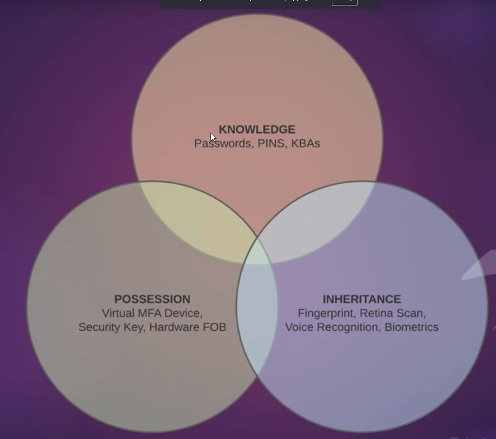

## IAM Authentication & Security
- In AWS two main types of authentication include `conole(web-interface)` and `programatic(CLI, AWS PowerShell tools)`.
- `Console access` authenticates using a `password, and MFA if inabled`.
- `Programmatic access` authenticates using an `Access Key ID, and Secret Access Key`.
### Authentication Best Practices:
  - Never Use Root-Account unless Necessary.
  - Each IAM user has `their own account`, no sharing accounts between multiple users for better audit.
  - Each individual in an organization should have their own account with unique access credentials for better audit.
  - A Password policy should always be implimented, in order to ensure each user establishs a secure password.
  - Assign Permissions to IAM users `using groups`.
  - `Grant Least privilege` - this concept refers to `granting the lowest level of permissions` to an IAM identity to begin with, and gradually increase them as the need arises.
    - most `AWS policies` come with diffirent options regarding the actions that can be performed within the service or resource. 
    **options can include**: list, read, write, permissions management, or tagging.
  - Check policy access dates and delete policies that have not been used for some time -> to allign more with `Grant Least Privelege - concept`.
  - Use `Customer managed policies` instead of `inline policies`.
  - Frequently `rotate` passwords and Access Keys. 
  - Never sharing or publicly posting either a pw or secret access hey.
  - store access keys and secret access keys securely. preferably in an encrypted file.
  - Disable access keys that have not been used for some time.
  - Delete IAM users that are no longer needed on the AWS account.
  - Enabling MFA on the main root account, and any IAM user accounts.
  - When Possible , Use `IAM ROLES` to access AWS resources, rather than programmatically. -> this way the access key ID does not have to be hardcodes into the application.
    - **Benefits**: when configured correctly IAM will dynamically manage the credentials for you with temporary credentials hat are rotated automatically.
    - **Note**: `only possible` if recources requiring access are `running inside AWS`.
  - **If Service Outside AWS**: require `programmatic access`, it's best to `create dedicated service accounts and policies` specifically for `each use case`. Ex: 
  - Use `temporary access credentials` from `AWS STS` (AWS security Token Services).
    - this service meant to be used with `IAM Roles`, where a `trusted relationship between identities and resources` is established.
    - thes access tokens are only valid for a certain period of time, which reduces any future risk of misuse.
### Rotating IAM-USERS Access Keys 
- **Steps**:  `IAM > Users > check column (Access-Key-Age & Last-Activity) > Select-Intended-User > Security Credentials > Make old Key inactive && Create access key`
### IAM Multi-Factor Auth (MFA)
- MFA requires a user to authenticate using credentials from `Two Distincs categories`, these categories includes `Knowledge(pw,pins,securityQuests), Possession(your devices), Inheritance(what you are)`.
  
- **When MFA enabled** the auth-sequence will look as follow:
  - User > PW Credential > MFA Authenticating presented > Success
  - `Steps`:
    1. Knowledge based Credentials : either  (AccId || AccAlias) or (Email && PW Combo).
    2. IF(KBC -> success) - MFA includes (Possession or Inheritance) Test
    3. User is granted access upon successful Auth of Both security Layers .
  - **AWS MFA Compatible Devices**:
    -  `Virtual MFA` this have to be done in specified time Interval , Ex: Google Authenticator, Authy.
    -  `Unversal 2nd Factor (U2F) Security Key`, Inheritance Ex: Yubikey (usb device that uses fingerprint). 
    -  `Hardware Key Fob`, similar to virtual MFA but only requires the hardware, no additional software needed Ex: Gemalto Token.
### IAM Credentials Report
- Credentials Report offers important information relevant to each IAM-User and their activities whithin the account. 
The report can be used to ensure compliance with credential life cycle requirement such as password and access key rotation.
- **How To Get It**:
  - IAM-Dashboard > Credential report > Download Report(csv-format)
- **Report Include Info Such**:
  - user, arn, userCreationTime, pwEnabled?, pwLastUsed, pwLastChanged, pwNextRotation,  accessKey1LastRotated, accessKey1LastUsed, accessKey2Active, ..., cert1Active, cert1LastRotated, ... .
 
---
# IAM-Administration
- Viewing user access history before making changes or deleting a user from an AWS account. You may need to access information on how or when the account was last used. 
AWS-Mangement-Console is equipped with an `Access-Advisor` wich provides detailed information for `(Groups,Users,Policies,Roles)`.
 You can use `IAM-Credentianls-Report` download CSV file for an overview as well. 

## Users
- An IAM-User consist of a name and credentials. The user is an entity that represents the person or application interacting with an AWS service.
- When we initially set up an AWS account, we're logged in as the Root User. The root account has access to all services by default.
- By default an IAM User account cannot access any services within the AWS account, until policies are created.
- **Important Points on IAM**:
  - An IAM-User that is created to `represent applications` are Known as `Service accounts`.
  - Each IAM user has `their own account`, no sharing accounts between multiple users for better audit.
  - Each individual in an organization should have their own account with unique access credentials for better audit.
  - A Password policy should always be implimented, in order to ensure each user establishs a secure password.
  - **Ther are `3 ways an IAM-User is Identified by AWS`**:
    - UserName, ARN - Amazon Resource Name (used to uniquely identify the user across all of AWS), ID - Unique Identifier (only returned when using the API, PowerShell, or AWS CLI)
    - A `single AWS account` can have up to `5000` users.
  - **IAM-User can Auth and Access AWS in `4 ways`**:
    - `AWS-Console-Password` (web-browser) used to sign in to AWS Management Console
    - `Access-Keys` (AWS-CLI, AWS-PowerShell-tools)- used for programmatic calls to AWS. 
    - `SSH-Keys` (SSH-Clients) - used when authenticating with SSH clients, and CodeCommit.
    - `Server Certificates`.
## Groups
## Policies
## Roles
- IAM roles are a secure way to grant permission to entities that you trust, IAM roles issue keys that are valid for short durations, making them a more secure way to grant access.  
- **Entities example**: 
  - IAM user in another account. 
  - Application code running on an EC2 instance needs to perfor actions on AWS resources. 
  - An AWS service that needs to act on resources in your account to provide its feature ex:EKS need role for EC2 to create its node groupe. 
  - Users from a corporate directory who use identity federation with SAML.
- **Types of Trusted Entity**: (AWS service, Another AWS account, Web dentity, SAML 2.0 federation)
- **Roles Attributes**: name, description, Trusted entities(Aws service, Web, ... ), Policies, Permissions boundary, Maximum session duration(default 1h), ARN, Instance Profile ARNs.
**common usecases**:
- Roles are commonly used to grant EC2 instances, permission to execute actions on S3 storage.
  - Ex: giving an EC2/Lambda/Others Instances permission to Read/write objects to an S3 bucket.
  - **Note**: an EC2/Lamdba/Others instances deployed by any IAM identity, does not have permission to execute any action on S3, there for a role is required for that.
  
-  
